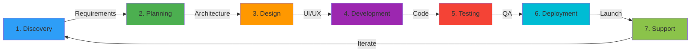

<div align="center">


<p align="center">
  
</p>

[](https://coretechholdings.co.za)
[](mailto:info@coretechholdings.com)
[](https://coretechholdings.co.za)
[_11_123_4567-25D366?style=for-the-badge>)](tel:+27111234567)

<p align="center">
  
  
  
</p>

---

### 🏆 _Award-Winning South African Software Development Company_

</div>

<br>

## 📖 Table of Contents

- [About Us](#-about-us)
- [Our Services](#-our-services)
- [Technology Stack](#-technology-stack)
- [Featured Projects](#-featured-projects)
- [Why Choose Coretech](#-why-choose-coretech)
- [Our Process](#-our-process)
- [Industries We Serve](#-industries-we-serve)
- [Client Success Stories](#-client-success-stories)
- [Open Source Contributions](#-open-source-contributions)
- [Career Opportunities](#-career-opportunities)
- [Get In Touch](#-get-in-touch)

<br>

## 🎯 About Us


**Coretech Holdings** is a leading South African software development company specializing in innovative, scalable technology solutions for businesses worldwide. Founded with a vision to bridge the technology gap and empower businesses through digital transformation, we've grown into a trusted partner for organizations seeking cutting-edge software development, AI implementation, cybersecurity solutions, and comprehensive digital transformation services.

### 🌟 Our Mission

To deliver world-class technology solutions that drive business growth, enhance operational efficiency, and create lasting value for our clients across the globe.

### 🎯 Our Vision

To be Africa's premier technology partner, recognized globally for innovation, quality, and exceptional client service.

### 💎 Our Values

- **Innovation First**: Constantly exploring new technologies and methodologies
- **Quality Driven**: Delivering excellence in every line of code
- **Client Focused**: Your success is our success
- **Transparency**: Open communication at every stage
- **Agile & Adaptive**: Flexible solutions that grow with you

<br>

## 🚀 Our Services

<div align="center">

### We Transform Ideas Into Digital Reality

</div>

<table>
<tr>
<td width="50%" valign="top">

### 🤖 **Artificial Intelligence Solutions**


**Transform your business with intelligent automation**

- 🧠 Machine Learning & Predictive Analytics
- 🗣️ Natural Language Processing (NLP)
- 👁️ Computer Vision & Image Recognition
- 🤖 Chatbots & Virtual Assistants
- 📊 Data Science & Business Intelligence
- 🔮 AI Strategy & Consulting
- ⚡ Custom AI Model Development
- 🎯 AI Integration & Deployment

**Technologies**: TensorFlow, PyTorch, Scikit-learn, OpenAI API, Hugging Face

</td>
<td width="50%" valign="top">

### 💻 **Software Development**


**Custom solutions built for your unique needs**

- 🌐 Web Application Development
- 📱 Mobile App Development (iOS & Android)
- 🖥️ Desktop Application Development
- 🔌 API Development & Integration
- ☁️ Cloud-Native Applications
- 🎨 UI/UX Design & Development
- 🛒 E-commerce Platforms
- 📈 Enterprise Software Solutions

**Technologies**: React, TypeScript, Node.js, Python, Flutter, React Native

</td>
</tr>
<tr>
<td width="50%" valign="top">

### 🔒 **Cybersecurity Services**


**Protect your digital assets with enterprise-grade security**

- 🛡️ Security Audits & Assessments
- 🔐 Penetration Testing
- 🚨 Vulnerability Management
- 🔑 Identity & Access Management
- 📡 Network Security Solutions
- 🔍 Security Monitoring & SIEM
- 📋 Compliance & Risk Management
- 🎓 Security Awareness Training

**Compliance**: POPIA, GDPR, ISO 27001, PCI DSS

</td>
<td width="50%" valign="top">

### 🚀 **Digital Transformation**


**Modernize your business for the digital age**

- 📊 Digital Strategy & Consulting
- ☁️ Cloud Migration & Optimization
- 🔄 Legacy System Modernization
- 🤝 System Integration
- 📱 Digital Customer Experience
- 🏢 Enterprise Architecture
- 📈 Process Automation
- 🎯 Change Management

**Platforms**: AWS, Azure, Google Cloud, Supabase, Firebase

</td>
</tr>
</table>

<br>

## 🛠️ Technology Stack

<div align="center">

### _We Build With The Best Tools In The Industry_

</div>

#### **Frontend Development**

<p align="center">


</p>

#### **Backend Development**

<p align="center">


</p>

#### **Mobile Development**

<p align="center">


</p>

#### **Database & Storage**

<p align="center">


</p>

#### **Cloud & DevOps**

<p align="center">


</p>

#### **AI & Machine Learning**

<p align="center">


</p>

<br>

## 🌟 Featured Projects

<div align="center">

### _Building Solutions That Make A Difference_

</div>

<table>
<tr>
<td width="50%">

### 🎯 [Coretech Holdings Platform](https://coretechholdings.co.za)


**Our flagship web platform showcasing modern full-stack development**

#### ✨ Key Features

- 🔐 Secure authentication & user management
- 🛒 Complete e-commerce marketplace
- 💳 Subscription management system
- 📱 Fully responsive design
- 🌓 Dark/Light theme support
- 📊 Real-time analytics dashboard
- 💬 Blog & content management
- 📧 Contact system with CRM integration

#### 🛠️ Tech Stack

```
Frontend: React 18 • TypeScript • Vite
Styling: Tailwind CSS • Shadcn/ui
Backend: Supabase (PostgreSQL)
Auth: Supabase Auth
State: React Query (TanStack)
```

#### 📈 Project Stats


</td>
<td width="50%">

### 🤖 AI-Powered Analytics Platform


**Enterprise-grade AI analytics for data-driven decision making**

#### ✨ Key Features

- 📊 Real-time data processing
- 🤖 ML-powered predictions
- 📈 Interactive dashboards
- 🔍 Natural language queries
- 🚨 Anomaly detection
- 📱 Multi-device support
- 🔐 Enterprise security
- 📤 Automated reporting

#### 🛠️ Tech Stack

```
Frontend: Next.js • TypeScript
Backend: Python • FastAPI
AI/ML: TensorFlow • Scikit-learn
Database: PostgreSQL • Redis
Cloud: AWS (EC2, S3, Lambda)
```

#### 📈 Impact Metrics


</td>
</tr>
</table>

<br>

## 💡 Why Choose Coretech?

<div align="center">

```
╔══════════════════════════════════════════════════════════════════╗
║                                                                  ║
║     🏆  10+ Years Combined Team Experience                      ║
║     🌍  Serving Clients Across 3 Continents                     ║
║     ⚡  98% On-Time Project Delivery Rate                       ║
║     🎯  95% Client Satisfaction Score                           ║
║     🔒  100% Security Compliance Record                         ║
║     💼  50+ Successful Projects Delivered                       ║
║                                                                  ║
╚══════════════════════════════════════════════════════════════════╝
```

</div>

<table>
<tr>
<td width="33%" valign="top">

### 🌍 **Global Expertise, Local Presence**

We combine international best practices with deep understanding of the South African market and business environment.

**Benefits:**

- Time zone advantage for African & European clients
- Competitive pricing with premium quality
- Local regulatory compliance expertise
- English-speaking development teams

</td>
<td width="33%" valign="top">

### 🚀 **Cutting-Edge Technology**

We stay ahead of the curve, constantly adopting and mastering the latest technologies to give you a competitive advantage.

**Our Approach:**

- Regular team training & upskilling
- Innovation labs for R&D
- Early adopters of proven technologies
- Future-proof architecture design

</td>
<td width="33%" valign="top">

### 🤝 **Partnership Philosophy**

We're not just vendors; we're your technology partners invested in your long-term success.

**What This Means:**

- Transparent communication
- Flexible engagement models
- Post-launch support & maintenance
- Strategic technology consulting

</td>
</tr>
</table>

<br>

## 🔄 Our Process

<div align="center">

### _From Concept To Launch: Our Proven Methodology_

</div>



<table>
<tr>
<td width="14%" align="center">

### 🔍

**Discovery**

Understanding your vision, goals, and requirements

</td>
<td width="14%" align="center">

### 📋

**Planning**

Detailed project roadmap and timeline

</td>
<td width="14%" align="center">

### 🎨

**Design**

User-centered design and architecture

</td>
<td width="14%" align="center">

### 💻

**Development**

Agile development with regular updates

</td>
<td width="14%" align="center">

### 🧪

**Testing**

Rigorous QA and user testing

</td>
<td width="14%" align="center">

### 🚀

**Deployment**

Smooth launch and migration

</td>
<td width="14%" align="center">

### 🛠️

**Support**

Ongoing maintenance and optimization

</td>
</tr>
</table>

<br>

## 🏢 Industries We Serve

<div align="center">

### _Delivering Tailored Solutions Across Multiple Sectors_

</div>

<table>
<tr>
<td width="25%" align="center">

### 🏦

**Finance & Banking**

Digital banking platforms, payment gateways, fraud detection

</td>
<td width="25%" align="center">

### 🏥

**Healthcare**

EMR systems, telemedicine, health tracking apps

</td>
<td width="25%" align="center">

### 🛒

**E-commerce**

Online stores, marketplace platforms, inventory management

</td>
<td width="25%" align="center">

### 🎓

**Education**

Learning management systems, online courses, student portals

</td>
</tr>
<tr>
<td width="25%" align="center">

### 🏭

**Manufacturing**

IoT solutions, supply chain management, predictive maintenance

</td>
<td width="25%" align="center">

### 🏨

**Hospitality**

Booking systems, guest management, revenue optimization

</td>
<td width="25%" align="center">

### 🚗

**Transportation**

Fleet management, route optimization, booking platforms

</td>
<td width="25%" align="center">

### 📱

**Technology**

SaaS products, developer tools, API platforms

</td>
</tr>
</table>

<br>

## 🎉 Client Success Stories

<div align="center">

### _Transforming Businesses, One Project At A Time_

</div>

> ### 💼 **Financial Services Platform**
>
> **Challenge**: Legacy banking system limiting growth and customer experience  
> **Solution**: Modern cloud-based platform with mobile apps and real-time analytics  
> **Results**:
>
> - ✅ 300% increase in mobile transactions
> - ✅ 65% reduction in operational costs
> - ✅ 98% customer satisfaction score

---

> ### 🏥 **Healthcare Management System**
>
> **Challenge**: Paper-based patient records causing inefficiencies  
> **Solution**: Comprehensive EMR system with patient portal and analytics  
> **Results**:
>
> - ✅ 80% faster patient check-in process
> - ✅ 50% reduction in administrative errors
> - ✅ Improved patient care coordination

---

> ### 🛒 **E-commerce Platform**
>
> **Challenge**: Low conversion rates and limited scalability  
> **Solution**: Custom marketplace with AI-powered recommendations  
> **Results**:
>
> - ✅ 250% increase in conversion rate
> - ✅ 400% growth in daily transactions
> - ✅ Seamless scaling during peak periods

<br>

## 🌐 Open Source Contributions

<div align="center">

### _Giving Back To The Developer Community_

</div>

We believe in the power of open source and actively contribute to the community:

<table>
<tr>
<td width="50%" align="center">

### 📚 **Our Open Source Projects**


</td>
<td width="50%" align="center">

### 🤝 **Community Engagement**


</td>
</tr>
</table>

We contribute to popular projects including **React**, **TypeScript**, **Node.js**, **Tailwind CSS**, and various South African tech initiatives.

<br>

## 💼 Career Opportunities

<div align="center">

### _Join Our Growing Team_


</div>

We're always looking for talented individuals who are passionate about technology and innovation.

### 🚀 **Current Openings**

- 💻 **Senior Full Stack Developer** - React • Node.js • TypeScript
- 🤖 **Machine Learning Engineer** - Python • TensorFlow • PyTorch
- 📱 **Mobile App Developer** - React Native • Flutter
- 🎨 **UI/UX Designer** - Figma • Adobe XD
- 🔒 **Cybersecurity Specialist** - Penetration Testing • Security Audits
- ☁️ **DevOps Engineer** - AWS • Docker • Kubernetes

### 💎 **Why Join Coretech?**

```
✅ Competitive Salaries & Benefits
✅ Remote/Hybrid Work Options
✅ Professional Development Budget
✅ Latest Technology Stack
✅ Collaborative Culture
✅ Career Growth Opportunities
✅ Flexible Working Hours
✅ Innovation Time (20% for personal projects)
```

**Interested?** Email your CV to: [careers@coretechholdings.com](mailto:careers@coretechholdings.com)

<br>

## 📊 Organization Stats

<div align="center">


</div>

<br>

## 📞 Get In Touch

<div align="center">

### _Let's Build Something Amazing Together_


</div>

<table>
<tr>
<td width="50%" align="center">

### 🌐 **Visit Our Website**

[](https://coretechholdings.co.za)

Explore our services, portfolio, and client testimonials

</td>
<td width="50%" align="center">

### 📧 **Email Us**

[](mailto:info@coretechholdings.com)

Get in touch for consultations and quotes

</td>
</tr>
<tr>
<td width="50%" align="center">

### 📞 **Call Us**

[_11_123_4567-25D366?style=for-the-badge&logo=whatsapp&logoColor=white>)](tel:+27111234567)

Speak directly with our team

</td>
<td width="50%" align="center">

### 📍 **Location**

[](https://coretechholdings.co.za)

Proudly based in South Africa, serving globally

</td>
</tr>
</table>

<br>

### 📝 **Request A Quote**

Interested in working with us? Fill out our contact form on our website or send us an email with:

- 📋 Project description
- 🎯 Your goals and objectives
- 📅 Timeline and budget
- 📞 Preferred contact method

We'll get back to you within 24 hours!

<br>

---

<div align="center">

### 🌟 **Follow Our Journey**


<br>

### 🇿🇦 **Proudly South African** 🇿🇦

_Building World-Class Solutions From The Heart Of Africa_

<br>


<sub>© 2025 Coretech Holdings. All Rights Reserved. | Made with ❤️ in South Africa</sub>

</div>
